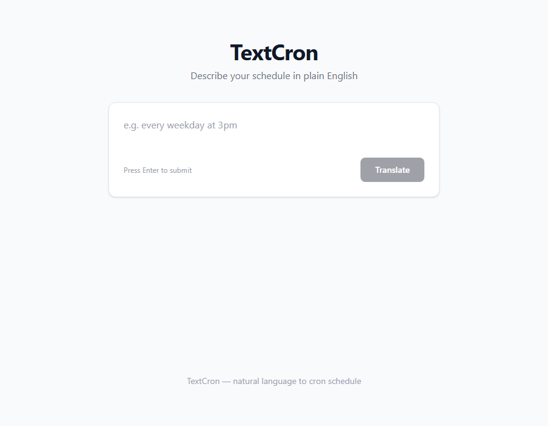
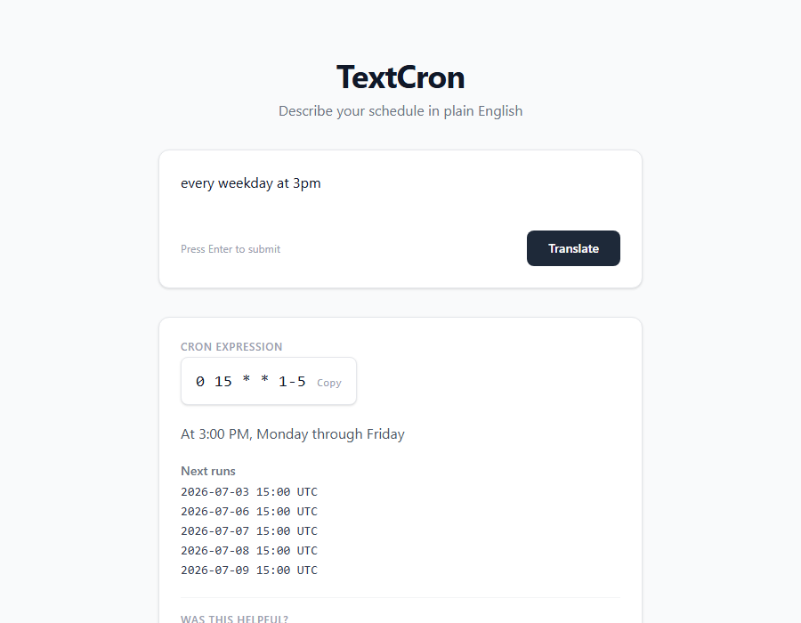
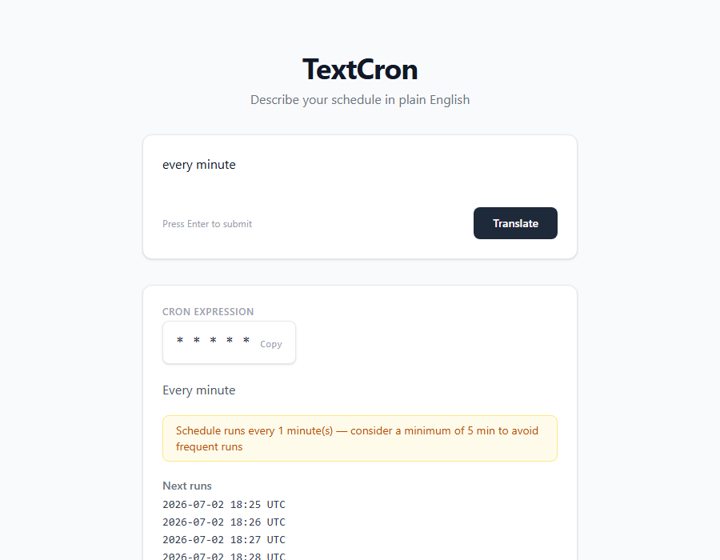
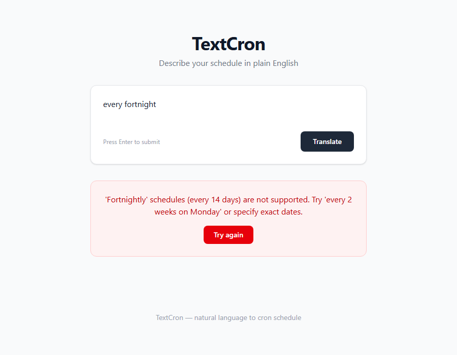

# TextCron

Describe your schedule in plain English and get a valid cron expression.

```
e.g. "every weekday at 3pm" → 0 15 * * 1-5
```

This app agentically engineered using Spec Driven Development (SDD) and Behaviour Driven Development (BDD). While it's easy to directly ask an LLM for the required cron expression described in plain text, this app is developed to demonstrate how to use guardrails, evals and Observability to create robust AI powered applications. 

## Screenshots

| Empty state | Successful translation |
|:---:|:---:|
|  |  |

| Warning (frequent schedule) | Error (unsupported concept) |
|:---:|:---:|
|  |  |

## Tech Stack

| Layer | Technology |
|-------|-----------|
| Backend | Python 3.12, FastAPI, Pydantic |
| LLM Gateway | litellm (provider-agnostic — Gemini, OpenAI, Anthropic, etc.) |
| Frontend | React 19, TypeScript, Tailwind CSS v4, Vite |
| Observability | Langfuse (self-hosted v2) |
| Infrastructure | Docker, Docker Compose, Nginx |

## Quick Start

```bash
cp .env.example .env
# Edit .env with LLM_API_KEY and LANGFUSE_* keys
docker compose up -d
```

Open http://localhost:80, describe your schedule, get a cron expression.

## How It Works

1. User submits a natural language schedule
2. LLM parses it into structured JSON fields (`minute`, `hour`, `day_of_month`, `month`, `day_of_week`)
3. Backend composes the fields into a cron expression and validates it
4. Response includes the cron expression, explanation, warning (if frequent), and a trace ID for feedback
5. Each translation is traced in Langfuse with model usage, token counts, timing, and optional user rating

## Endpoints

- `POST /api/translate` — convert text to cron
- `POST /api/validate` — validate a cron expression and preview next runs
- `POST /api/feedback` — submit user rating (positive/negative)

## Guardrails

- **Input validation**: length limit, character allowlist, time keyword check, gibberish detection
- **Output validation**: schema conformance, field range bounds, cron syntax check
- **Rate limiting**: 30 req/min per IP, 100 req/day global
- **Safety warning**: warns if expression fires more often than every 5 minutes

## Langfuse

Traces, generations (with model/tokens/cost), and user ratings are captured automatically. Point your browser to http://localhost:3000 and register to view the dashboard.

## Evaluation

### Golden Dataset

25 curated entries covering valid schedules, edge cases, and expected errors. Run with mock LLM (fast) or real LLM:

```bash
# Fast — uses mock responses
pytest tests/test_golden.py

# Real — calls the configured LLM
pytest tests/test_golden.py --real-llm --sample=5
```

### LLM-as-Judge

`scripts/eval_judge.py` evaluates translation quality across 4 dimensions (cron accuracy, error handling, explanation clarity, safety warnings) using a separate judge LLM. Reports are saved as JSON to `scripts/eval_results/`.

```bash
python scripts/eval_judge.py             # uses a separate judge model
python scripts/eval_judge.py --sample 10  # run on a subset
```

The judge auto-falls back to the system model on rate limits and computes a programmatic pass/fail from score thresholds alongside the LLM's verdict.

## Project Structure

```
backend/
  app/
    api/           translate, validate, feedback endpoints
    models/        Pydantic schemas
    services/      LLM, cron, guard, Langfuse client
    main.py        FastAPI app
  tests/           60 pytest tests (including golden dataset)
  scripts/         eval_judge.py — LLM-as-Judge evaluation

frontend/
  src/
    api/           API client
    components/    React components (InputCard, ResultCard, FeedbackWidget, etc.)
    hooks/         useTranslate
    pages/         HomePage
    types/         TypeScript interfaces
```
